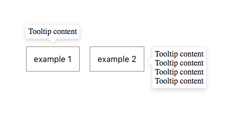

# Tooltip component

> Create a tooltip/popover component with React

## Task description

Your task is to build a general purpose React component to display tooltips and/or popovers for other React elements. To get the idea, below is a simplified example of what we are looking for:

You are provided with a starter repository with pre-configured build-tools for making the task. You are not expected to spend time on the tools, but you can, if you wish.

We expect you to:
* design a good API for the component (How will it be used?)
* follow good React code and design patterns
* really think about the problems of a such component and solve those (How to make it cover as many use cases as possible?)
* be able to explain your decisions afterwards and discuss any potential drawbacks and features of the component
* impress us by making it beautiful (style and animations)
* show how it can be used via various examples (react-storybook)
* ask us more questions if you are uncertain of what we are looking for

We don't want you to:
* use 3rd party React libraries to solve the problem directly
* spend time on tooling

Feature requirements:
* display tooltip on mouseover and/or click
* part of the task is to come up with the rest of the requirements yourself based on the description of our expectations

Technical requirements:
* React `v.16.0.0^`
* JavaScript (ECMAScript 6 specification)
* Usage of CSS modules (pre-configured)

## Get started

1. run `npm install`
2. run `npm start`
3. open `localhost:9001`
4. write your implementation in `src/Tooltip.js`

### Notes

* You can use either SASS (`.scss`) or LESS (`.less`) files for styles; both are pre-configured.
* You can add or change Webpack settings in `.storybook/webpack.config.js`, if needed.
* When submitting the task, zip everything (including hidden files) except `node_modules`. If you used Git, include also `.git`.
